# Testing <!-- omit in toc -->

## Table of Contents
- [HTML Validator](#html-validator)
  - [W3C HTML Markup Validation Service](#w3c-html-markup-validation-service)
- [CSS Validator](#css-validator)
  - [W3C CSS Validation Service](#w3c-css-validation-service)
- [JavaScript](#javascript)
  - [JSHint](#jshint)
- [Compatability](#compatability)
  - [Manual Testing](#manual-testing)
  - [Automated Testing](#automated-testing)
    - [Test Driven Development](#test-driven-development)
    - [Chrome Dev Tools - Lighthouse](#chrome-dev-tools---lighthouse)
- [User Stories](#user-stories)
- [Bugs](#bugs)
  - [1. Bug: Audio is not playing on mobile #55](#1-bug-audio-is-not-playing-on-mobile-55)
  - [2. Bug: As a user, when I start the game I should not be immediately hit by an asteroid #60](#2-bug-as-a-user-when-i-start-the-game-i-should-not-be-immediately-hit-by-an-asteroid-60)
  - [3. As a user I should be able to move the ship using swipes or a button keypad when playing the game on mobile #6](#3-as-a-user-i-should-be-able-to-move-the-ship-using-swipes-or-a-button-keypad-when-playing-the-game-on-mobile-6)
  - [4. Bug: game is double clicking to zoom on mobile #99](#4-bug-game-is-double-clicking-to-zoom-on-mobile-99)
  - [5. Unresolved Bug: Audio is delayed when playing on physical Android device #97](#5-unresolved-bug-audio-is-delayed-when-playing-on-physical-android-device-97)
  - [6. Unresolved Bug: HTML5 Audio pool exhausted, AudioContext was not allowed to start #98](#6-unresolved-bug-html5-audio-pool-exhausted-audiocontext-was-not-allowed-to-start-98)

 

# HTML Validator

## [W3C HTML Markup Validation Service](https://validator.w3.org/)

 

- [Menu Page (index.html)]([https://link](https://github.com/leithdm/milestone-project-2/blob/master/index.html))

 

**Result:** No Errors or warnings

----------

 

- [Game Page (game.html)](https://github.com/leithdm/milestone-project-2/blob/master/game.html)

 

**Result:** No Errors or warnings

----------

 

- [High Score Page (high-score.html)](https://github.com/leithdm/milestone-project-2/blob/master/high-score.html)

 

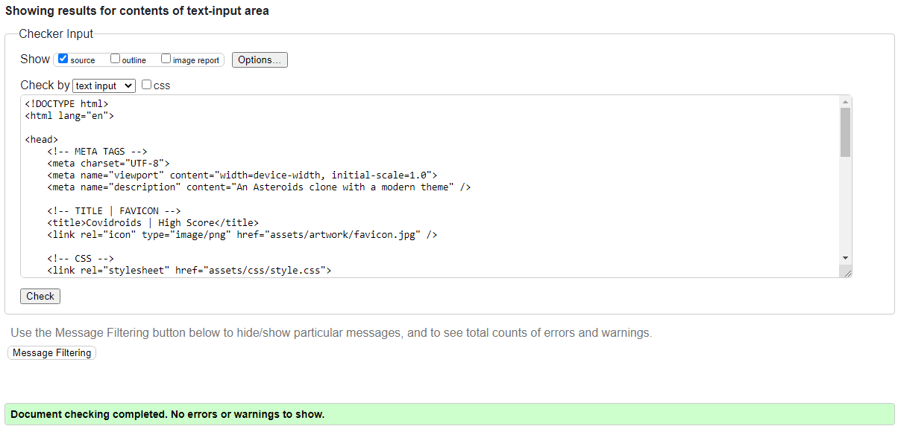

**Result:** No Errors or warnings

----------

 

- [How To Play Page (how-to-play.html)](https://github.com/leithdm/milestone-project-2/blob/master/how-to-play.html)

 

**Result:** No Errors or warnings

----------

 

# CSS Validator

## [W3C CSS Validation Service](https://jigsaw.w3.org/css-validator/)

 

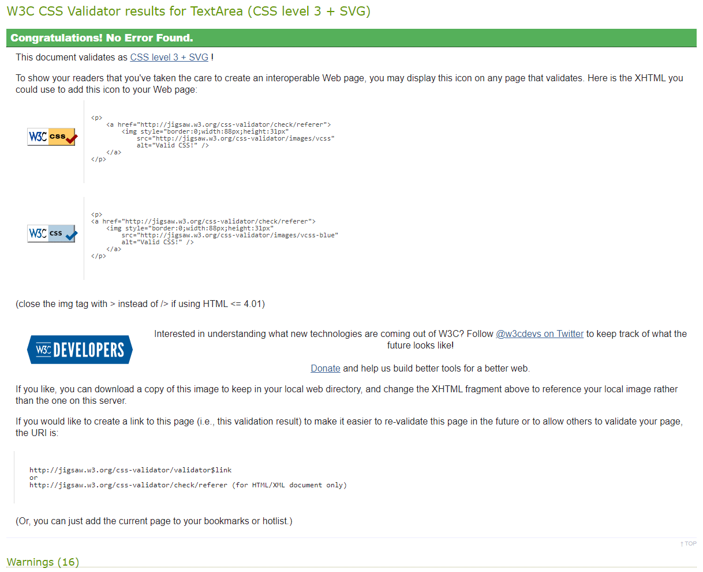

**Result:** No Errors, 36 warnings. Regarding the warnings, the validator found x22 generic warnings related to the use of CSS variables. The W3C validator [does not support CSS variables](https://github.com/w3c/css-validator/issues/111), so these warnings are expected. The validator also warned that deepest possible browser support for stylings such as `box-shadow`, `transform` and `user-select` were "unknown vendor extensions", however the use of `webkit`, `moz` and `ms` prefixes in front of these items is required in order to provide full browser support. In summary, all 36 warnings were noted, but ignored.

It is also worth noting that W3C initially produced a *"too few values for the property linear-gradient"* error when css variables were used to define the linear-gradient colors i.e.

` background: linear-gradient(to bottom, var(--red-controller), var(--maroon-controller));`

A number of fixes were tried, including redefining the css variable in `:root` by removing references to `rgb` and declaring:

` background: linear-gradient(to bottom, rgb(var(--red-controller)), rgb(var(--maroon-controller)));`

However, the only solution that worked was to remove the css variable within the linear-gradient entirely, and replace with the following:

`background: linear-gradient(to bottom, red, maroon);`

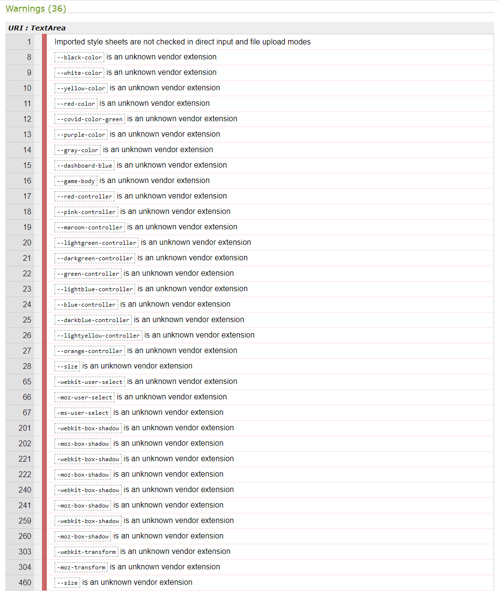

 

----------

# JavaScript

## [JSHint](https://jshint.com/)

- File: [asteroid.js](assets/js/asteroid.js)

**Result:** [No Errors](assets/testing/results/jshint-asteroid-testing.PNG) with x13 undefined variables (*undefined variables are ignored because these variables are all contained and defined within game-utilities.js / game-constants.js, which link to this file*).

- File: [bullet.js](assets/js/bullet.js)

**Result:** [No Errors](assets/testing/results/jshint-bullet-testing.PNG) with x8 undefined variables (*undefined variables are ignored because these variables are all contained and defined within game-utilities.js / game-constants.js, which link to this file*).

- File: [collision-detection.js](assets/js/collision-detection.js)

**Result:** [No Errors](assets/testing/results/jshint-collision-detection-testing.PNG) with x35 undefined variables (*undefined variables are ignored because these variables are all contained and defined within game-utilities.js / game-constants.js, etc, which link to this file*).

- File: [game-constants-testing.js](assets/js/game-constants.js)

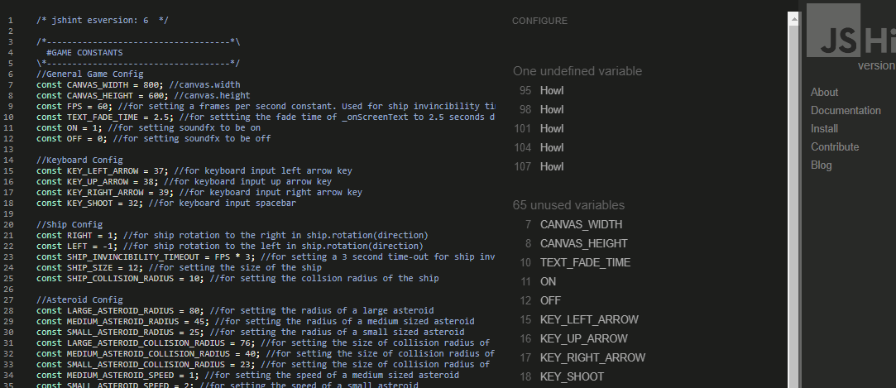

**Result:** [No Errors](assets/testing/results/jshint-game-constants-testing.PNG) with x65 unused variables, x1 undefined variable (*unused variables are ignored as these variables are all used within game-utilities.js, which link to this file. The x1 undefined variable is also ignored for the same reason*).

- File: [game.js](assets/js/game.js)

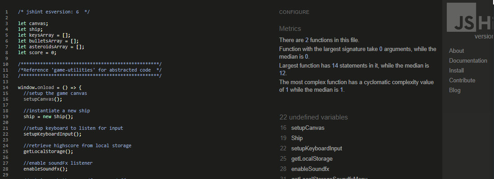

**Result:** [No Errors](assets/testing/results/jshint-game-testing.PNG) with x22 undefined variables (*undefined variables are ignored because these variables are all contained and defined within game-utilities.js / game-constants.js, which link to this file*).

- File: [game-utilities.js](assets/js/game-utilities.js)

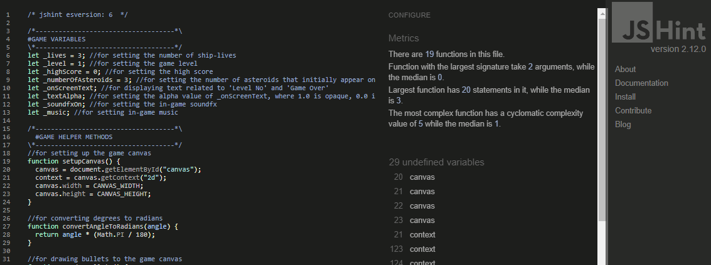

**Result:** [No Errors](assets/testing/results/jshint-game-utilities-testing.PNG) with x29 undefined variables (*undefined variables are ignored because these variables are all contained and defined within game-utilities.js / game-constants.js, which link to this file*)..

- File: [ship.js](assets/js/ship.js)

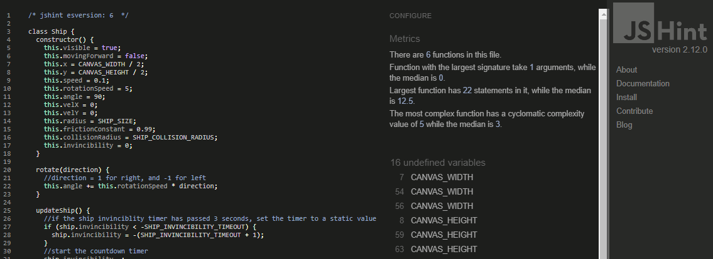

**Result:** [No Errors](assets/testing/results/jshint-ship-testing.PNG) with x16 undefined variables (*undefined variables are ignored because these variables are all contained and defined within game-utilities.js / game-constants.js, which link to this file*).

- File: [local-storage.js](assets/js/local-storage.js)

**Result:** [No Errors](assets/testing/results/jshint-local-storage-testing.PNG) with x14 undefined variables (*undefined variables are ignored because these variables are all contained and defined within game-utilities.js / game-constants.js, which link to this file*).

- File: [user-input.js](assets/js/user-input.js)

**Result:** [No Errors](assets/testing/results/jshint-user-input-testing.PNG) with x17 undefined variables (*undefined variables are ignored because these variables are all contained and defined within game-utilities.js / game-constants.js, which link to this file*).

 

----------

# Compatability

## Manual Testing

- Browser compatability: To ensure a broad range of users can successfully use this site, it was manually tested across the 6 major browsers:

  - Chrome v.87
  - Edge v.85
  - Firefox v.81
  - Safari v.12
  - Opera v.71
  - Internet Explorer v.6-11 (tested via [BrowserStack](https://www.browserstack.com/test-in-internet-explorer)).

 

- Site responsiveness was tested using [Chrome DevTools](https://developers.google.com/web/tools/chrome-devtools) using profiles for a wide variety of devices.

 

- Physical Devices tested included:
  - iPhone 5 (iOS: 12.4.9)
  - iPhone 6 (iOS: 12.4.9)
  - Samsung Galaxy A10 (Model SM-A105FN, Build/QP1A, on Android 10)
  - MacBook Pro (Retina, 13", Late 2013, OS Catalina)
  - Apple iMac 27" (running Windows 10 Pro ver. 2004, OS 19041.630)

 

**Result:** Both browser compatability and site responsiveness testing can be summarised in the table below. Responsiveness was good on all of the devices listed, both physical and simulated. Brower compatability was good across all the major browsers, except for Internet Explorer 6-11 where both the `canvas` and `grid` elements are only partially supported, or not supported at all (reference [IE canvas support](https://caniuse.com/?search=canvas) and [IE grid support](https://caniuse.com/?search=grid)).

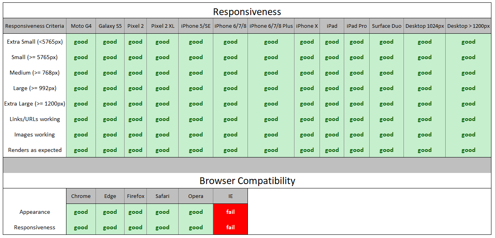

 

**IE browser incompatibility:** Lack of support for `canvas`, `grid` and css variable elements. Screenshot below shows *game.html* as displayed in IE 11.

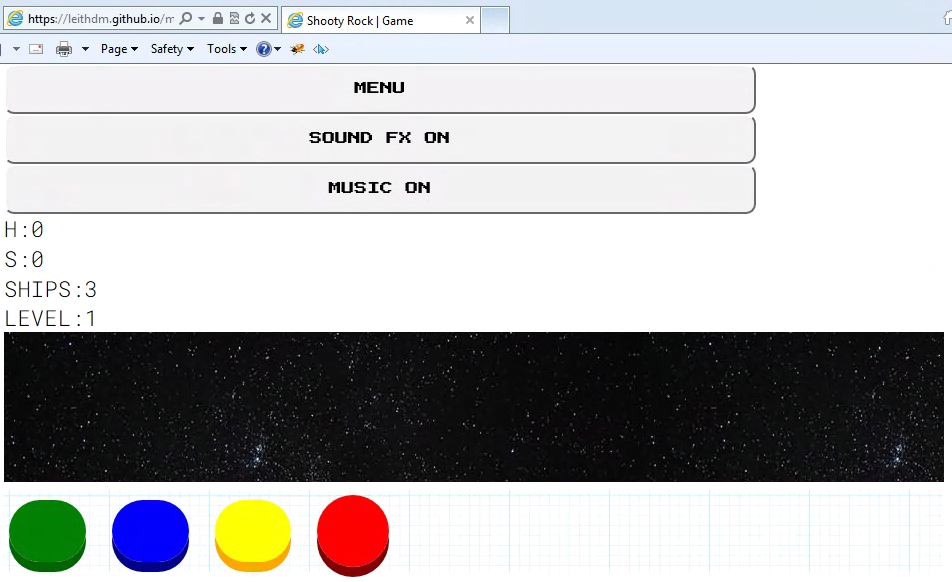

 

----------

## Automated Testing

### Test Driven Development

TDD was employed on this project when creating and interacting with the Asteroid, Bullet and Ship objects. The TDD cycle followed the red, green, refactor approach (...read more on this methodology via this [codecademy article](https://www.codecademy.com/articles/tdd-red-green-refactor)).

[Jasmine 3.6.0](https://jasmine.github.io/) was used to automate these tests, and they can be found in the [testing/spec](assets/testing/spec) folder. To run all of the automated tests use the [spec-runner.html](assets/testing/spec-runner.html) file.

**Result:** 46 specs, 0 failures.

 

----------

### Chrome Dev Tools - Lighthouse

Further automated testing was performed using [Chrome Dev Tools - Lighthouse](https://developers.google.com/web/tools/lighthouse). Lighthouse is an open-source, automated tool for improving the quality of web pages. It performs audits under the following headers:
1. Performance
2. Accessibility
3. Best Practices
4. SEO

**Result:** see summary results below for **Desktop *game.html***

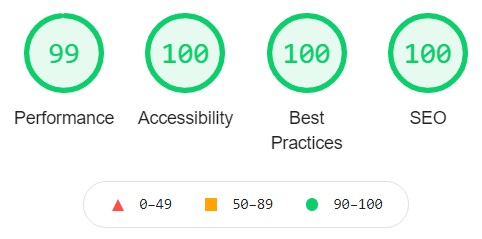

 

**Result:** see summary results below for **Mobile *game.html***

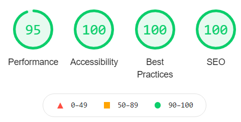

**Recommendations:** Performance improvements are recommended in the following areas:
- **Enable text compression:** in order to help the page load faster by up to 1.05s, it is recommended to compress the .js and .css files. It is also recommended to minify the .js to reduce payload sizes by up to 0.45s.
- **Remove invisible text:** there is a flash of invisible text (FOIT) while the *game.html* page waits on Font-Awesome to load. The game-pad controller briefly displays blank text for the up, left, and right button icons.
- **Use passive listeners to improve scrolling performance:** the browser does not know if the event listeners on *game.html* will prevent scrolling, so it waits for the listener to finish executing before scrolling the page. The recommendation is to add a `passive` flag to every event listener e.g.

`document.addEventListener('touchstart', onTouchStart, {passive: true});`

**Conclusion:** As the project is sitting at 99% performance on Desktop, and 95% on Mobile, the suggestions are taken under advisement, but are not implemented at this point in time.

 

----------

# User Stories

**Result:** All user stories have been successfully implemented, with a :white_check_mark: to denote items that have been implemented in this game.
- The full list of user stories with relevant screenshots **can be viewed in this [document](assets/testing/results/user-story-checklist.pdf).**

 

"**__As a user, I__** ______________________________________________"

- :white_check_mark: need to have a responsive game, playable from any device (mobile, tablet, desktop).
- :white_check_mark: should have an invincibility shield for a set period of time when game restarts.
- :white_check_mark: should see GAME OVER when I lose all my lives.
- :white_check_mark: should progress through the game via Levels i.e. Level 1, Level 2, etc.
- :white_check_mark: should have a triangular ship to match the original game.
- :white_check_mark: should see irregular shaped asteroids.
- :white_check_mark: should see an explosion when I shoot an asteroid.
- :white_check_mark: should be able to turn soundfx on and off as a menu option.
- :white_check_mark: should hear different sound-fx while playing the game.
- :white_check_mark: should have a visual cue for the number of lives I have during the game.
- :white_check_mark: should be able to shoot the asteroids with bullets.
- :white_check_mark: should be able to shoot bullets using keyboard input.
- :white_check_mark: should be able to move the ship using keyboard input.
- :white_check_mark: should be able to move my ship forwards, backwards, left, and right.
- :white_check_mark: should have my ship render onto the centre of the canvas at the start of the game.
- :white_check_mark: should feel friction when my ship is no longer moving forward, and my ship should finally stop.
- :white_check_mark: should be given 3 lives at the start of the game.
- :white_check_mark: should have a visual cue (explosion) when my ship is hit by an asteroid.
- :white_check_mark: should have a visual cue (afterburner at back of ship) when my ship is thrust forward.
- :white_check_mark: should see my score increment every time I shoot an asteroid. Different asteroids get different points.
- :white_check_mark: should see my ship reappear on the opposite side of the screen if I move off-screen.
- :white_check_mark: should see the large and medium sized asteroids break up into x2 smaller asteroids when hit by a bullet.
- :white_check_mark: should find the game easy to begin with, and as the game progresses it should get increasingly more difficult.
- :white_check_mark: should be able to shoot bullets by tapping a "FIRE" button when on mobile.
- :white_check_mark: should be able to move the ship using swipes or a button keypad when playing the game on mobile.
- :white_check_mark: should be able to click on a HIGH SCORES menu button, and be presented with the highest score.

 

----------

# Bugs

Using GitHub Projects, **a full list of closed bugs can be found [here](https://github.com/leithdm/milestone-project-2/issues?q=label%3Abug+is%3Aclosed+project%3Aleithdm%2Fmilestone-project-2%2F1)**. In this section we will highlight some of the more interesting ones.

## 1. [Bug: Audio is not playing on mobile #55](https://github.com/leithdm/milestone-project-2/issues/55)

Audio was originally added to the game using standard Audio() object instantiation:

`let audio = new Audio();`

`audio.play();`

  // see original code [here](https://github.com/leithdm/milestone-project-2/pull/53/commits/5d11760f70c9aeffe6cdade6a3197f76c360b31e)

This code worked fine on Desktop, but when testing on a physical Mobile device (Samsung Galaxy A10, iPhone 5), the audio would not play. Research revealed the [many](https://pupunzi.open-lab.com/2013/03/13/making-html5-audio-actually-work-on-mobile/) issues that can crop up when adding audio to a mobile HTML5 game, mostly due to browser/performance limitations. The solution was to make use of a 3rd party library, namely [Howler.js](https://howlerjs.com/). By linking to the holwer.js cdn, and adding code below, mobile audio worked.

`const fireSound = new Howl({`

`src: ["assets/audio/fire.webm",`

`"assets/audio/fire.mp3"]`

`});`

//see full solution code [here](https://github.com/leithdm/milestone-project-2/commit/82aa0e5f8b65385c9f0d2259552034d540a39c1a)

 

## 2. [Bug: As a user, when I start the game I should not be immediately hit by an asteroid #60](https://github.com/leithdm/milestone-project-2/issues/60)

When starting a new game, or restarting with a new life, the ship is placed in the centre of the screen. However, there was always a possibility that an asteroid would immediately collide with the ship, giving the player no time to react. This bug was resolved in 2 parts:
1. For a **new game**, create a collision zone which cannot be entered by an asteroid.
2. For a **new life**, make the ship invincible for a set period of time.

Item 1, *new game*,  was solved by randomly placing the asteroids onto the canvas, provided they do not collide with the ship within a specific radius.

//see full solution code [here](https://github.com/leithdm/milestone-project-2/pull/63/commits/8b086b5ec1e37de1f4756eb1e2ba425ac7ffa1cc).

Item 2, *new life*,  was more complicated, and required a 3-second countdown timer `SHIP_INVINCIBILITY_TIMEOUT`, as well as ensuring there was no collision detection between asteroids and the ship during this time period, and finally displaying an invincibility cloak for the ship.

//see full solution code [here](https://github.com/leithdm/milestone-project-2/commit/31a63c9a7b565079931cd3d85d4c32d43870c858).

 

## 3. [As a user I should be able to move the ship using swipes or a button keypad when playing the game on mobile #6](https://github.com/leithdm/milestone-project-2/issues/6)

On mobile, this game required the development of a gamepad controller. The controller had to be designed for usability, meaning button positioning and size required consideration.

- Initially, I coded a touch controller within a second `canvas` element, resulting in **Controller 1.0** :

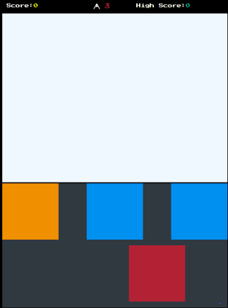

The issue with Controller 1.0 was that it was difficult to make the buttons mobile responsive across a large number of devices.

- To solve this bug, I moved over to `span` elements, abandoning the `canvas` element. This resulted in **Controller 2.0** :

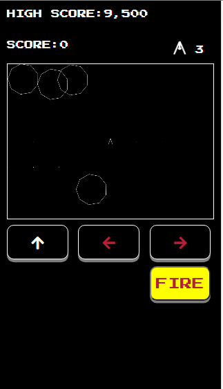

- Controller buttons were now fully mobile responsive, and easier to style, resulting in **Controller 3.0** :

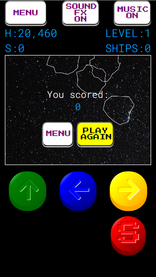

 

## 4. [Bug: game is double clicking to zoom on mobile #99](https://github.com/leithdm/milestone-project-2/issues/99)

- Physical devices tested:
  - Samsung Galaxy SM-A105FN Build/QP1A using Chrome 87.0.4280.86 on Android 10.
  - iPhone 5 (iOS: 12.4.9, Chrome v.87.0.4280.77)
  - iPhone 6 (iOS: 12.4.9 Chrome v.87.0.4280.77)
- **This was actually 2 issues in one:**
1. Firstly, a user could double tap anywhere on index.html, and the screen would automatically zoom in.
   - This was resolved by making use of the `pointer-events` CSS property, ie:

`* { `

` pointer-events: none`

`} `

and then enabling

`pointer-events: auto`

on the relevant elements that need to be clicked (i.e. menu buttons, and game-pad controller buttons).

1. Secondly, while playing the game on iOS mobile, the user could "pinch-to-zoom". This was most noticeable when the user was holding down the thrust key, and trying to shoot or move left/right at the same time, causing the entire screen to zoom in. This is actually an [accessibility feature of iOS +10](https://stackoverflow.com/questions/37808180/disable-viewport-zooming-ios-10-safari). Every solution suggested was tried from stack overflow from both [here](https://stackoverflow.com/questions/11689353/disable-pinch-zoom-on-mobile-web) and [here](https://stackoverflow.com/questions/4472891/how-can-i-disable-zoom-on-a-mobile-web-page/4472910#4472910), until the following code was added to resolve the bug:

`document.addEventListener('touchmove', (event) => {`

`event.preventDefault();`

`},  {passive: false });`

While physically testing, it is worth noting that responsiveness from the controller buttons on iOS mobile was actually better when the above code was not present. However, this enhanced responsiveness had to be balanced with the poor UX of having the screen zoom in/out every time the user pressed more than one controller button at once.

 

## 5. [Unresolved Bug: Audio is delayed when playing on physical Android device #97](https://github.com/leithdm/milestone-project-2/issues/97)

- Physical device tested: Samsung Galaxy SM-A105FN Build/QP1A using Chrome 87.0.4280.86 on Android 10.
- There is a delay of approx. 300-900ms from the time the shoot button is pressed, to when the audio is heard.
-

 

## 6. [Unresolved Bug: HTML5 Audio pool exhausted, AudioContext was not allowed to start #98](https://github.com/leithdm/milestone-project-2/issues/98)

- Device tested: Desktop using Chrome 87.0.4280.88 on Windows 10 Pro, Version 2004, OS build 19041.630.
- This bug was noticed when manually refreshing the game.html browser window. Audio continues to work fine, but the following *warning* (not error) shows up in the console log:
  - 'howler.min.js:2 The AudioContext was not allowed to start. It must be resumed (or created) after a user gesture on the page.'
  - 'howler.min.js:2 HTML5 Audio pool exhausted, returning potentially locked audio object.'

[Go back to README.md file](README.md).

